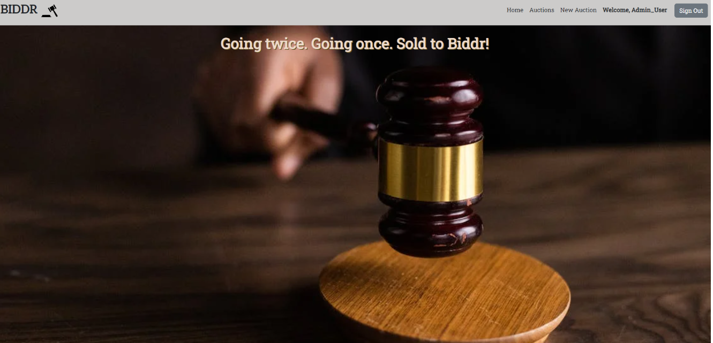
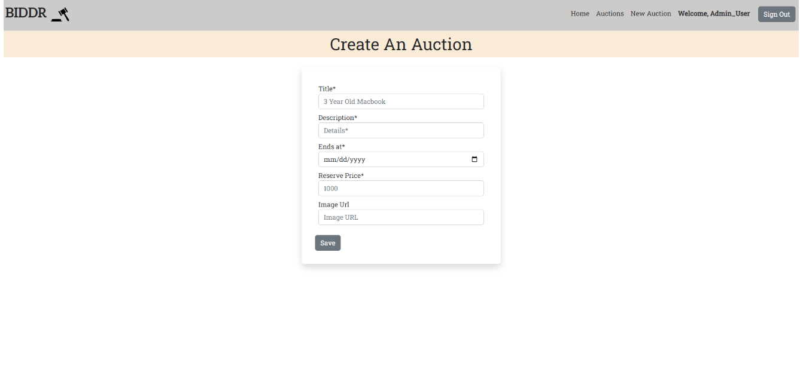

# Biddr

## Table of Contents
- Summary
- Demo Link
- Technologies Used
- Features
- Screenshots
- Installation

## Summary
Biddr is an auction app that allows users to create auctions and place bids.

## Technologies Used:

- Ruby on Rails for back-end API
- React.js for front-end
- Bootstrap
- HTML
- CSS
- Javascript
- PostgreSQL
- Postman for testing API

## Features

- Sign in and sign up as a user
- View auctions and place bids
- Create new auctions
- The current highest price of an auction
- Status of whether the reserve price has been met
- New bids have to be higher than the current highest bid

## Screenshots:
- Auctions Index Page:

- Auctions Show Page:
.png)
- Create a New Auction:

## Installation:

- git clone URL
- cd into project
- In biddr_api
    - Run rails db:create
    - Run rails db:migrate
    - Run rails db:seed
    - Run rails s
    - On the browser run localhost:3000
- In biddr_client
    - npm install
    - npm start
    - On the browser run localhost:5500
